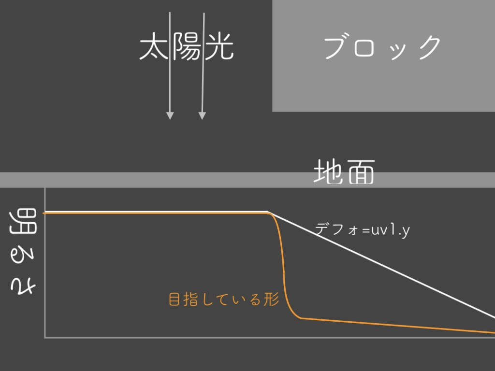
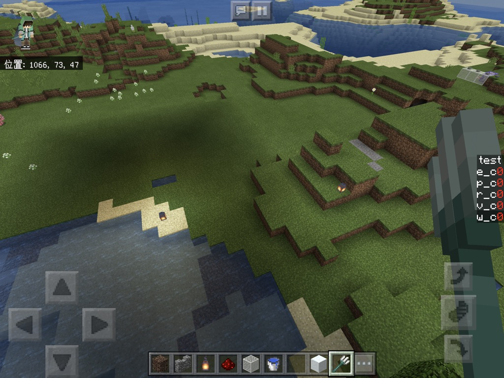
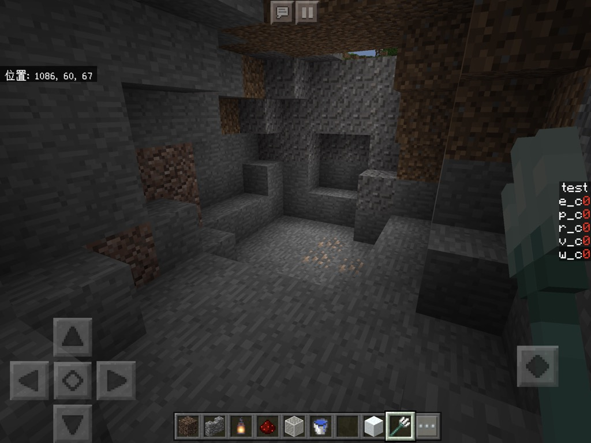

# #4 影作る。
[<< #3 型と演算子](?i=3)  
[トップ](?)  
[#5 トーンマップ >>](?i=5)

## index
- 検討
- 情報収集
- 設計
- 動かす!

2020/ 2/24作成  
2020/ 2/24更新

---
## 検討
いきなり影作るぞーなんて言っても困惑するだけですね、  
設計する前に影を作るにあたってどの情報があればいいか考えましょう…

- 太陽光
- 周りのブロックの位置

この二つを思い浮かべたあなた  
確かに何も間違っていません、  
駄菓子菓子世の中そう甘くないです。  
そんな贅沢な情報はマイクラは教えてくれないです。  
「じゃぁ動的な影ができないじゃん」→できないです  
ほぼ全てのBEのシェダーが固定された影を持つ理由は、まさにこれです。  
		
逆に考えてみましょう  
マイクラは何を教えてくれるか…

- 人工的な光源の強さ(だいたい)
- 真上から光を当てたときに日陰になる度合いみたいな何か

材料は調いましたね!  
前者はuv1という変数の第一要素  
後者はuv1の第二要素です。(つまりuv1.xとuv1.y)  
どちらも値域は0~1です(詳しいことはテクスチャについて調べてください)  
		  
## 情報収集
			uv1なんて言われたって分からんぞー状態なので挙動を確認しましょう。  
			renderchunk.fragmentに書いていきます。  
			renderchunk.fragmentに処理を書く際は、l84~l86の <code>#endif</code>と<code>#ifdef FOG</code>の間に書いていきます。  
			diffuse.rgbは最終的にgl_FragColorに代入されています。
```
diffuse.rgb = vec3(uv1,0);
```
これでuv1.xの値が赤にuv1.yの値が緑にそれぞれ代入されます  
青は強制的に0です  

  
分かりましたよね??(丸投げ)  
境目はくっきりした線ではないのです。  
なので"影"を作ってやるには、こちらで境目の値を調整してやる必要があります。  

## 設計
まずは基本となる影を作ります。  
関数としてそのまま考えると萎えるので、グラフと一緒に考えていきます。  
  
日陰になった途端明るさを落とせばいいわけです。  
関数に書き起こしてみます  
  
smoothstepを使うと赤線の関数が作れます。  
smoothstep(a,b,x)は、xがa以下の時に0,b以上の時に1になるような  
滑らかな連続した数を返してくれるone of the 超絶クソ便利関数です。  
より詳しく知りたい人は[公式のレファレンス](https://www.khronos.org/registry/OpenGL-Refpages/gl4/html/smoothstep.xhtml)を見るといいです。  
	
そこにさらにmixを使うと
mix(a,b,x)は、x=0の時にa,x=1の時にbを返す線形補完された数(つまりb*x+a*(1-x))  
を返すone of the 超絶クソ便利関数です。  
[公式のレファレンス](https://www.khronos.org/registry/OpenGL-Refpages/gl4/html/mix.xhtml)  
(hlslではlerpという名前になっていますが中身はだいたい同じです)  
	
最後に松明などの明かりを使った時に影が消えるようにします。  
これがないと洞窟の中で松明つけてもめちゃくらい惨事になるので割と重要です。  
光源はuv1.xに入っているので最終的な影のかけ具合をmixを使って調整します。  
		
これで設計は完了です。  
inが0の時にoutが0になってないですが、あとでマイクラのデフォルトと合成するので問題ないです。  
glslに書き起こしてみます  

```
float shadow = mix(0.5, 1.0, smoothstep(0.865, 0.875, uv1.y));
diffuse.rgb *= mix(shadow, 1.0, uv1.x);
```
		  
## 動かす!
ほい  

  
ほいほい  

  
ゴキブリホイホイ  

  
ちょっと暗いですかね、  
上手く調整してください。  


---
今回の完成品、[こちら](https://mcbeeringi.github.io/how/src/how_src_4.mcpack)から確認できます。  
mixとsmoothstepの組み合わせは本当に便利なので覚えておくといいです  
	
次回はユーザー定義関数についてです。  
トーンマップで世界観を変えます。  
お楽しみに!  
