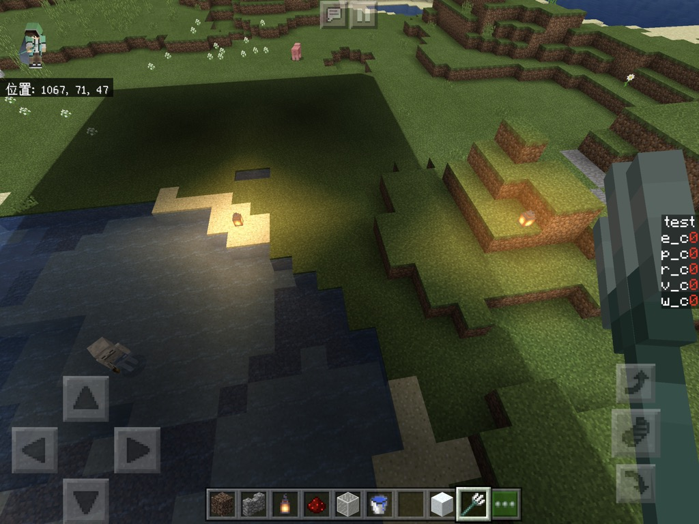
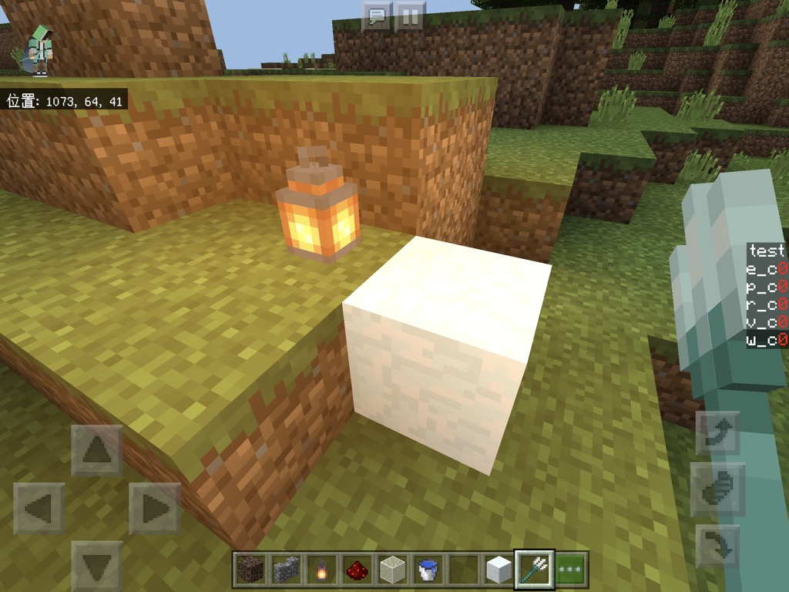
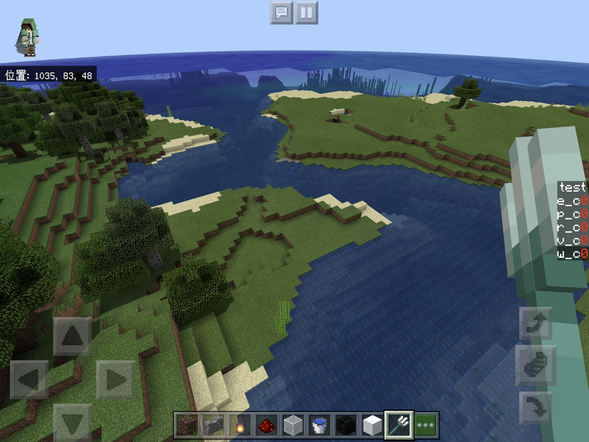

# #5 トーンマップ
[<< #4 影作る。](?i=4)  
[トップ](?)  
[#6 sinな葉っぱ >>](?i=6)

## index
- 復習
- トーンマップ

2020/ 2/24作成  
2020/ 2/24更新

---
## 復習


前回作り忘れたものがあるので  
復習がてらささっと作っちゃいましょう。  
松明の色の話です。  
	
光源の情報はuv1.xに0~1で入っているので、  
それを元にこちらで用意した色(今回はvec3(1,0.5,0))を載せていきます。  
```
diffuse.rgb += vec3(1,0.5,0)*uv1.x;
```

  
明るすぎますね  
```
diffuse.rgb += vec3(1,0.5,0)*max(uv1.x-0.5,0.0);
```
maxは二つの引数のうちの大きい方を返す関数です。  
[公式のレファレンス](https://www.khronos.org/registry/OpenGL-Refpages/gl4/html/max.xhtml)  
一般的な言語と違って引数は二つしか取れないです。  
今回はuv1.x-0.5が0以下になった時に0を返すようにしています。  

  
マシになりましたがこれでは明るい色のブロックが白飛びしてしまいます。  
  
```
diffuse.rgb += vec3(1,0.5,0)*max(uv1.x-0.5,0.0)*(1.0-diffuse.rgb);
```
ブロックの元の明るさに応じて載せ具合を変えてみます。  
  
問題なさそうですね。  
本編に入ります(前置き長い)  


<h2>トーンマップ</h2>


トーンマップとはざっくり言うと画像をきれいに見せる加工手法の一つです。  
色付きのフィルターみたいなもんです。  
要はただの関数です。  
いろんなものがありますが  
いろいろなものを比較検討していきたいですが  
復習でかなり食ったので結論から行きます。  
[https://knarkowicz.wordpress.com/2016/01/06/aces-filmic-tone-mapping-curve/](https://knarkowicz.wordpress.com/2016/01/06/aces-filmic-tone-mapping-curve/)
```
vec3 ACESFilm(vec3 x)
{
float a = 2.51;
float b = 0.03;
float c = 2.43;
float d = 0.59;
float e = 0.14;
return clamp((x*(a*x+b))/(x*(c*x+d)+e),0.,1.);
}
```
glslも関数を自分で定義することができます。  
最初のvec3は関数が返す型、括弧の中は受け取る引数です。  
突然出てきたclampですがclamp(x,a,b) = min(max(x,a),b)です。  
[公式のレファレンス](https://www.khronos.org/registry/OpenGL-Refpages/gl4/html/clamp.xhtml)  
	
これを<code>void main(){</code>の前に入れます。  
松明の処理の辺りでこの関数を通します。  
```
diffuse.rgb = ACESFilm(diffuse.rgb);
```

  
ちなみにRGB各要素に直接トーンマップをかけるのではなく  
明るさをベースにトーンマップをかける方法もあります
```
vec3 lum_tonemap(vec3 col){
return col/dot(col, vec3(0.298912, 0.586611, 0.114478))*ACESFilm(col);
}
```
```
diffuse.rgb = lum_tonemap(diffuse.rgb);
```
こちらは彩度を保ったままにできます。  
  
	
このトーンマップは入力が10の時に出力が1になるので  
入力に1以上の値を入れることもできます。  
(とても明るい→輝くような表現)  
となると、先ほどの光源で白飛びを抑えるコードがありましたが  
トーンマップを通す前に書くならこれは要らないということです。  
サンプルではトーンマップの後に書いていますが  
トーンマップの前に持ってきて試してみてください。  

---
こちら[今回のサンプル](https://mcbeeringi.github.io/how/src/how_src_5.mcpack)です。  
pow関数を使うと色の制御がしやすかったりと、  
ここで紹介しなかったこともたくさんありますので試してみてください。  
	
次回は葉っぱを揺らす予定です。  
