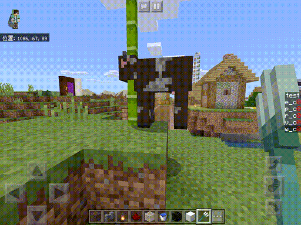
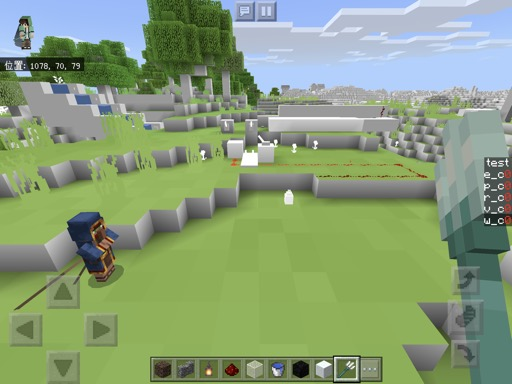
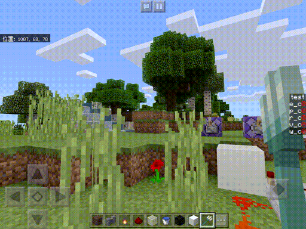

# #6 sinな葉っぱ
[<< #5 トーンマップ](?i=5)  
[トップ](?)  
[#7 空を描く(前編) >>](?i=7)

## index
- sib
- 葉の特定
- 風の表現

2020/ 4/18作成  
2020/ 4/18更新

---
## sin
今回はタイトルの通りsinを使って葉っぱを揺らしていきます(素)  
今までの色の操作と違って頂点座標の操作になるのでvertex(renderchunk.vertex)に書いていきます。  
renderchunk.vertexに自分の処理を書く際は特にここじゃなきゃダメと言う場所はないですが、  
l85~l87の間に書くのがおすすめです。  
```
#endif
//ここ
///// blended layer (mostly water) magic
#ifdef BLEND
```
処理の流れとしては実際のブロックの座標を動かすのは面倒+重いので  
今回はスクリーンの座標情報が格納されたgl_Positionを編集していきます。  
	
sinはグラフに表すと0,0から始まる1~-1の間で周期的に変化する波になりますね。  
時間とともに変化させたいのでTIME変数を適当に早めたものをsinに入れて、  
それを適当に縮めた値をgl_Position.x(画面のx座標)に加算します…  
(比較的新しいapple端末で動かすとhighpにしないとかくつくので一度TIMEをhTimeに代入します)  
```
highp float hTime = TIME;
gl_Position.x += sin(hTime*4.0)*0.1;
```
  
葉っぱを揺らすどころの騒ぎじゃないですね😇  

## 葉の特定
葉っぱだけでなく普通のブロックなども含めて全部揺れてしまいました。  
マイクラからもらえる情報から葉っぱを絞り込んでいきます。  
マイクラの葉っぱと言われて思い当たること…  

- 部分的に透けてる
- バイオームで色が変わる

この二つの条件で絞り込むとどうでしょう?  
葉っぱだけでなく草やサトウキビも判定に入ってしまいますが、  
これは全く問題ないですよね。  
ということでこれで絞り込んでいきます。  
	
まず部分的に透けているもののみ揺らします。  
```
#ifdef ALPHA_TEST
	highp float hTime = TIME;
	gl_Position.x += sin(hTime*4.0)*0.1;
#endif
```
#ifdefはシェダーがマイクラにコンパイルされる前に実行されるif文のようなものです。  
その頂点に対してALPHA_TESTが宣言されているかどうかで振り分けます。  
  
レバーやランタンも揺れています。  
あと一歩。  
	
マイクラからシェダーに渡される変数の一つにCOLORがあります。  
リアルタイムorバイオームで色味が変わるブロックは、  
だいたいこのCOLORを利用しています。  
  
"COLORに色がついていること"を条件に加えます。  
```
#ifdef ALPHA_TEST
	if(COLOR.g != COLOR.b){
		highp float hTime = TIME;
		gl_Position.x += sin(hTime*4.0)*0.1;
	}
#endif
```
こっちは普通のif文を使います。  
!=は比べているものが等しくない場合にtrueを返します。  
  
一部RSが揺れてますがそこはあなたに任せます。  

## 風の表現
全てのブロックが同じように左右に揺れているだけで  
風で葉っぱが揺れてるーなんていうのは流石に  
  
ので頂点の座標を使って揺れをずらしていきます。  
vertexにはマイクラからPOSITIONが渡されてくるので  
それを使います。  
```
#ifdef ALPHA_TEST
	if(COLOR.g != COLOR.b){
		highp float hTime = TIME;
		vec3 p = POSITION.xyz;
		gl_Position.x += sin(hTime*3.0 + 2.0*p.x + 2.0*p.z + p.y)*0.02;
	}
#endif
```
sinの中にPOSITIONの各要素を適当に伸ばして足しただけです。  
見栄えが良くなるように少し調整しました。  
  
いい感じですねー  
			
これでも十分ですが  
ここに風が流れる表現を追加したいと思います。  
皆さんはハッシュをご存知でしょうか。  
ある情報を元に生成された意味を持たない情報、  
つまりノイズみたいなものです。  
ただ、ハッシュの特徴として入力する情報が同じだと、  
いつでも出力も同じになるというものがあります。  
これを利用することでランダムな風が流れる表現を作れます。  
今回はこちらの軽量なハッシュ関数を利用します。  
[https://www.shadertoy.com/view/4djSRW](https://www.shadertoy.com/view/4djSRW)  
トーンマップの時と同じようにvoid mainの前に関数を定義します。  
```
float hash11(float p)
{
	p = fract(p * .1031);
	p *= p + 33.33;
	p *= p + p;
	return fract(p);
}
```
ハッシュ関数を滑らかにつないで滑らかなノイズを生成する関数を作ります。  
詳しくはパーリンノイズで検索。(どうせ次回やる)  
ここはそこそこ計算精度必要なのでhighpつけます。  
```
highp float hash11(highp float p)
{
	p = fract(p * .1031);
	p *= p + 33.33;
	p *= p + p;
	return fract(p);
}
highp float rand(highp vec3 p){
	highp float x = (p.x+p.y+p.z)/3.0+TIME;
	return mix(hash11(floor(x)),hash11(ceil(x)),smoothstep(0.0,1.0,fract(x)))*2.0;
}
```
見栄えのために地域を2倍(0~2)にしています。  
最後にこれを最初のコードに足します。  
```
#ifdef ALPHA_TEST
	if(COLOR.g != COLOR.b){
		highp float hTime = TIME;
		vec3 p = POSITION.xyz;
		gl_Position.x += sin(hTime*3.0 + 2.0*p.x + 2.0*p.z + p.y)*rand(p)*0.02;
	}
#endif
```
  
ゆらぎをもたせることでかなり自然になったのではないでしょうか。

---
[今回のサンプル](https://mcbeeringi.github.io/how/src/how_src_6.mcpack)です。  
チャンクの境目で切れ目が出てしまいますが、POSITIONの本質を理解すると  
`vec3 p = POSITION.xyz;`を改良することで消すことができます。  
(海外のシェダー屋さんも悩むレベルの問題　かなり難しい)  
次回からは最後にちょっと触れたノイズを使って雲を描いていきます  
