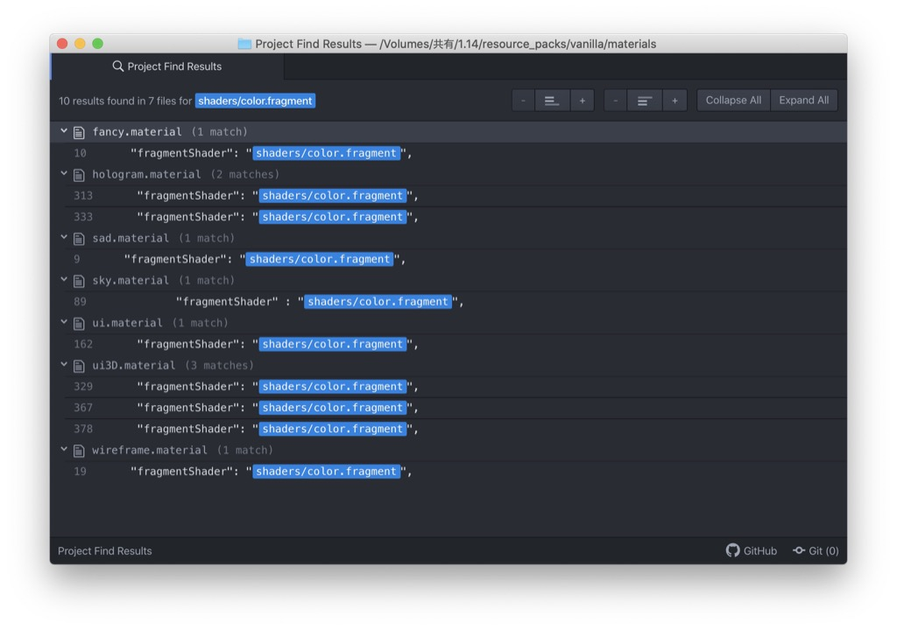
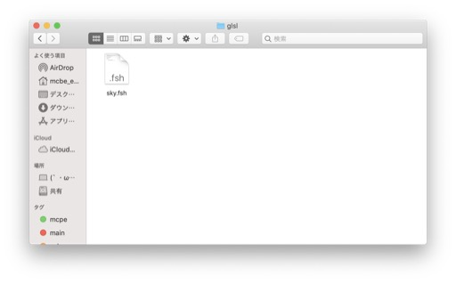

# #7 空を描く(前編)
[<< #6 sinな葉っぱ](?i=6)  
[トップ](?)  
[#8 雲を描く(後編) >>](?i=8)

## index
- materialを見る
- 引き起こされる問題とその対処法
- 処理を書く前に

2019/ 4/18作成  
2021/ 4/18更新

---
## materialを見る
空を担当するシェダーを特定するためにmaterialを見に行きます  
それっぽいところをあたっていきましょう  
	
sky.material
```
{
"sun_moon":{
	………
},
"stars":{
	………
},
"cubemap":{
	………
},
"skyplane":{
	………
},
"end_sky":{
	………
}
}
```
書くまでも無いとは思いますが一応↓  
sun_moon→太陽と月  
stars→星  
cubemap→textures/overworld_cubemapのあれ ポリゴンの形は立方体  
skyplane→空 ポリゴンの形は八角形  
end_sky→エンドの空 ポリゴンの形は立方体    
今回の目的にはskyplaneが一番合ってそうですね  

sky.material>skyplane
```
"skyplane": {
"states": [ "DisableDepthWrite", "DisableAlphaWrite" ],

"vertexShader" : "shaders/sky.vertex",
"vrGeometryShader" : "shaders/sky.geometry",
"fragmentShader" : "shaders/color.fragment",
"vertexFields": [
	{ "field": "Position" },
	{ "field": "Color" }
],
"msaaSupport": "Both"
},
```
statesやvertexFieldsはopengl本体に対する指令です  
webglとか触ったことある人は聞き覚えあるでしょう  
msaaはアンチエイリアシング関連のものと思われますが詳細な挙動は確認して無いです    
sky.vertexとcolor.fragmentをいじればいいことは分かりましたね

## 引き起こされる問題とその対処法
sky.vertexとcolor.fragmentをいじる前に確認すべきことがあります  
感の良い方はなんとなく予想ついているでしょう  
なぜcolor.fragmentなんて名前がついているのでしょう  
それはmaterialsフォルダをこの名前で検索すると分かります  
  
他の場所でも同じシェダーを使っているのです  
このままの状態でcolor.fragmentをいじると予期しない場所に空が出現する原因になります  
(過去にSS10shaderで起きていたバグはこれに起因するものだったり)  
ので、なんらかの手段で処理を分ける必要があります  

対処法はいくつかありますが  
一番分かりやすい方法は新しいシェダーファイルを作って  
それをmaterialで指定する方法です  
  
今回はsky.fshという名前で作りました  
中身はcolor.fragmentを同じです  
materialにパスを書くときは言語名の階層を抜く必要があります  
ただのjsonなので必要な部分以外は記載しなくても動きます  

sky.material
```
{
"skyplane":{
	"fragmentShader":"shaders/sky.fsh"
}
}
```
これで空の処理をcolor.fragmentから分離することができました  
このままsky.fshをいじってもいいのですが…  

## 処理を描く前に
コードを書く前にsky.vertexとsky.fshの中を見てみましょう  
  
sky.vertex
```
(前略)
varying vec4 color;

void main()
{
gl_Position = WORLDVIEWPROJ * POSITION;
color = mix( CURRENT_COLOR, FOG_COLOR, COLOR.r );
}
```

sky.fsh(color.fragment)
```
(前略)
varying vec4 color;

void main()
{
gl_FragColor = color;
}
```
vertexでプログラムから渡された空の色と霧の色を混ぜて  
fragmentはそれを吐いているだけになっています  
(COLOR.rには天頂からの距離を表すデータが入っています)  

skyplaneは最初に述べたとおり八角形をしたただの平らな板です  
このままではsky.fshに処理を書いて混ぜただけでは空の端に不自然な切れ目ができてしまいます  
  
ので、霧の処理をfshに移動します  
(ちなみにrenderchunk.fragmentは元々そうなっている)  

varyingでCOLOR.rとCURRENT_COLORをfshに渡します  
FOG_COLORはuniformから来ているのでfsh側で直接取得できます  
その他いろいろ整理したものがこちらです↓  

sky.vertex
```
// __multiversion__
// This signals the loading code to prepend either #version 100 or #version 300 es as apropriate.
//@McbeEringi MIT_LICENSE mcbeeringi.github.io/how

#include "vertexVersionSimple.h"

uniform MAT4 WORLDVIEWPROJ;

attribute mediump vec4 POSITION;
attribute vec4 COLOR;

varying float fog;
varying POS3 pos;

void main()
{
gl_Position = WORLDVIEWPROJ * POSITION;
fog = COLOR.r;
pos = POSITION.xyz;
}
```

sky.fsh
```
// __multiversion__
// This signals the loading code to prepend either #version 100 or #version 300 es as apropriate.
//@McbeEringi MIT_LICENSE mcbeeringi.github.io/how

#include "fragmentVersionSimple.h"

uniform vec4 CURRENT_COLOR;
uniform vec4 FOG_COLOR;

varying float fog;
varying POS3 pos;

void main()
{
vec4 diffuse = CURRENT_COLOR;
//write your codes here
gl_FragColor = mix(diffuse,FOG_COLOR,fog);
}
```
最後の `gl_FragColor = mix(diffuse,FOG_COLOR,fog);`が霧の処理になっています  

---
今回はデフォルトのシェダーをいじりやすくするための作業しかしていないので  
見た目にはほとんど変化がありません  
がしかし、これはとても重要な作業なので一回分使わせていただきました  
こちら[今回のサンプル](https://mcbeeringi.github.io/how/src/how_src_7.mcpack)です  
次回からノイズを使って雲本体を描いていきます  
お楽しみに  
